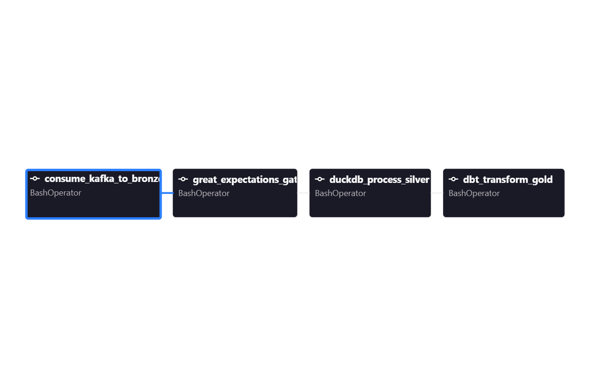

#  Ledger Sync: Lakehouse & Data Pipeline

**Ledger Sync** is a fault-tolerant, micro-batch data pipeline built on the Medallion Architecture. It ingests simulated, erratic logistics telemetry via Apache Kafka, quarantines corrupted sensor data using strict data contracts, and calculates rolling delivery SLA breaches using a decoupled OLAP compute engine.

---

## Pipeline Architecture

The project processes streaming events through a strict **Bronze ➔ Silver ➔ Gold** lakehouse progression, orchestrated entirely by Apache Airflow.

*The `ledger_sync` DAG enforcing the Medallion pipeline dependency chain.*

### 1. Ingestion Buffer (Kafka)
A standalone Python producer (`kafka_logistics_producer.py`) simulates active delivery fleets by pumping telemetry events (`PICKUP`, `TRANSIT`, `DELIVERED`) into a local Apache Kafka stream. It deliberately injects corrupted data (negative ping latencies) 10% of the time to simulate real-world sensor chaos.

### 2. Bronze Layer (Airflow ➔ AWS S3)
The `consume_kafka_to_bronze` task acts as an idempotent micro-batch consumer. It polls the Kafka topic, enforces strict schema validation using **Pydantic**, and drops the raw JSON payloads into an AWS S3 Bronze bucket (`s3://ledger-sync-bronze/`).

### 3. Data Quality Gate (Great Expectations)
Before downstream processing, the `great_expectations_gate` task evaluates the S3 Bronze data against predefined statistical boundaries. It ensures tracking numbers are non-null and ping latencies fall within physical bounds (0–10000 ms). 

### 4. Silver Layer (DuckDB ➔ S3 Parquet)
Operating as a serverless in-memory compute engine, the `duckdb_process_silver` task utilizes DuckDB's `httpfs` and `aws` extensions to natively authenticate and scan the S3 Bronze bucket. It filters out corrupted records, aggregates the latest scan statuses, and writes highly optimized Parquet files to the Silver bucket (`s3://ledger-sync-silver/`).

### 5. Gold Layer (dbt)
The `dbt_transform_gold` task connects `dbt-duckdb` to the Silver Parquet data. It executes advanced SQL transformations (Window Functions, CTEs) to calculate total `transit_hours`, rolling 7-day delivery averages, and flags shipments breaching the 48-hour SLA (`is_sla_breached`).

---

## Core Engineering Challenges Overcome

### Preventing Pipeline Halts via Anomaly Thresholds
**The Problem:** The simulated IoT sensors generate impossible physics (negative ping latencies). A strict 100% data quality gate caused the pipeline to fail immediately, preventing any data from reaching the warehouse.

**The Solution:** Configured **Great Expectations** to utilize a Tolerance Threshold (`mostly=0.85`). This ensures the pipeline proceeds as long as 85% of the micro-batch is statistically sound, allowing DuckDB to safely filter out the remaining 15% anomalies downstream without bottlenecking the entire orchestration flow.

### Idempotency & Safe Polling on Empty Streams
**The Problem:** If the Kafka topic had no new events, the consumer would hang infinitely, or DuckDB would crash with an `IO Error` when attempting to scan an empty S3 bucket.

**The Solution:** 
* Implemented an `empty_poll` timeout in the Kafka consumer to gracefully flush and exit after 5 seconds of silence.
* Built a pre-flight `list_objects_v2` safety check into the DuckDB processor to cleanly skip execution if the S3 Bronze bucket is empty.

